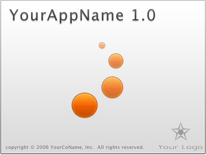

# QuickPhones

Aplicação desktop Java/Swing para gerenciamento centralizado de contatos, desenvolvida em 2008. Permite cadastrar, buscar e organizar contatos com dados como nome, telefone, endereço, e-mail e observações, com controle de acesso por usuários e permissões de administrador.



## Tecnologias

- **Java 5+** com **Swing** (Java Desktop Application Framework)
- **Hibernate 3** como ORM
- **MySQL 5**
- **Apache Ant** (projeto NetBeans)

## Hibernate ORM

O projeto utiliza **Hibernate 3** para o mapeamento objeto-relacional (ORM), abstraindo o acesso ao banco de dados MySQL.

### Entidades e mapeamentos

As entidades são POJOs mapeados via arquivos XML (`.hbm.xml`):

| Entidade | Classe | Mapeamento | Tabela |
|----------|--------|------------|--------|
| Contato | `quickphones.entity.Contato` | `Contato.hbm.xml` | `CONTATO` |
| Usuário | `quickphones.entity.Usuario` | `Usuario.hbm.xml` | `USUARIO` |

**Contato** armazena: nome, telefone, endereço, CEP, pessoa de contato, e-mail e observações.

**Usuario** armazena: apelido (login), senha (hash MD5), nome, e-mail, flags de administrador e desabilitado, além de versionamento otimista (`version`).

### Configuração

O arquivo `src/quickphones/model/hibernate.cfg.xml` contém a configuração da conexão e os mapeamentos registrados. A `SessionFactory` é inicializada em `HibernateUtil`.

### Padrão DAO

O acesso a dados segue o padrão **DAO Factory**:

- **`QuickPhonesDAOFactory`** — interface que define os DAOs disponíveis
- **`HibernateDAOFactory`** — implementação que instancia DAOs com sessão Hibernate
- **`ContatoDAO`** — operações sobre contatos (herda de `GenericHibernateDAO`)
- **`UsuarioDAO`** — operações sobre usuários (herda de `GenericHibernateDAO`)
- **`HibernateUtil`** — utilitário singleton para obter a `SessionFactory`

## Pré-requisitos

- **JDK 5** ou superior
- **MySQL 5** (ou compatível)
- **Apache Ant** (ou NetBeans IDE)
- Biblioteca `br.com.perettis.gets` (veja nota abaixo)

## Configuração

### Banco de dados

1. Crie um banco de dados MySQL chamado `quickphones`:

```sql
CREATE DATABASE quickphones CHARACTER SET utf8;
```

2. Crie as tabelas `CONTATO` e `USUARIO` conforme os mapeamentos `.hbm.xml`.

### Conexão Hibernate

Edite `src/quickphones/model/hibernate.cfg.xml` e configure o host, usuário e senha do seu MySQL:

```xml
<property name="hibernate.connection.url">
    jdbc:mysql://localhost:3306/quickphones?autoReconnect=true
</property>
<property name="hibernate.connection.username">
    root
</property>
<property name="hibernate.connection.password">
    changeme
</property>
```

## Compilar e executar

```bash
# Compilar
ant compile

# Gerar JAR
ant jar

# Executar
ant run
```

Ou abra o projeto diretamente no **NetBeans IDE**.

## Estrutura do projeto

```
QuickPhones/
├── build.xml                          # Build Ant (NetBeans)
├── src/
│   └── quickphones/
│       ├── QuickPhonesApp.java        # Classe principal (main)
│       ├── QuickPhonesView.java       # Tela principal
│       ├── Autenticacao.java          # Tela de login
│       ├── CadastroContato.java       # Cadastro de contatos
│       ├── CadastroUsuario.java       # Cadastro de usuários
│       ├── entity/
│       │   ├── Contato.java           # Entidade Contato
│       │   ├── Contato.hbm.xml        # Mapeamento Hibernate
│       │   ├── Usuario.java           # Entidade Usuário
│       │   └── Usuario.hbm.xml        # Mapeamento Hibernate
│       ├── model/
│       │   ├── hibernate.cfg.xml      # Configuração Hibernate
│       │   ├── HibernateUtil.java     # SessionFactory
│       │   ├── HibernateDAOFactory.java
│       │   ├── QuickPhonesDAOFactory.java
│       │   ├── ContatoDAO.java
│       │   ├── UsuarioDAO.java
│       │   └── Seguranca.java         # Utilitário de criptografia
│       └── resources/                 # Imagens e propriedades i18n
└── nbproject/                         # Configuração NetBeans
```

## Nota sobre `br.com.perettis.gets`

Este projeto depende da biblioteca `br.com.perettis.gets`, que fornece classes base como `GenericHibernateDAO`, `DAOFactoryAbstract`, `CryptoMD5` e utilitários Swing (`OnEnterTab`). O código-fonte da biblioteca está disponível em: **https://github.com/vperetti/gets4java**

## Aviso de segurança

Este é um projeto **educacional/histórico** de 2008. Algumas práticas não atendem padrões de segurança modernos:

- **Hash MD5 para senhas**: a classe `Seguranca.java` utiliza MD5 via `CryptoMD5` para hash de senhas. MD5 é considerado inseguro para este fim — em um projeto moderno, use bcrypt, scrypt ou Argon2.
- **Sem HTTPS/TLS**: a conexão com o banco de dados não utiliza SSL.

**Não utilize este projeto em produção sem revisar e atualizar as práticas de segurança.**

## Licença

Este projeto é distribuído sob a [GNU General Public License v3.0](LICENSE).
